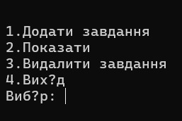
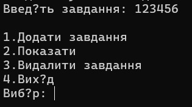
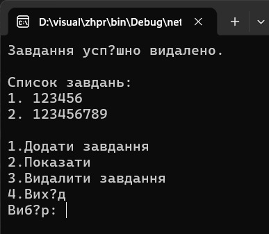

# Task Manager
Простий консольний застосунок для керування списком завдань, створений мовою C# у середовищі Visual Studio 2022.
## Опис проєкту
Програма дозволяє:
* додавати нові завдання;
* переглядати список завдань;
* видаляти завдання;
* працювати через консольне меню.
## Функціональні можливості
### Додавання завдання
Користувач вводить текст нового завдання, після чого воно додається до списку.
### Перегляд списку
Відображаються всі наявні завдання з нумерацією.
### Видалення завдання
Користувач вводить номер завдання, яке необхідно видалити.
### Вихід з програми
Завершення роботи застосунку.
## Технології
* C#
* .NET
* Visual Studio 2022
* Git
* GitHub
## Запуск проєкту
1. Відкрити рішення у Visual Studio 2022.
2. Натиснути F5 або кнопку Start.
3. Використовувати меню програми.
## Приклад роботи
### Головне меню

### Додавання завдання

### Список завдань

## Структура проєкту
Program.cs — основний файл програми.
## Документація для розробників
Детальні правила роботи з проєктом наведені у файлі:
[CONTRIBUTING.md](CONTRIBUTING.md)
## Автор

Михайло Козорог
